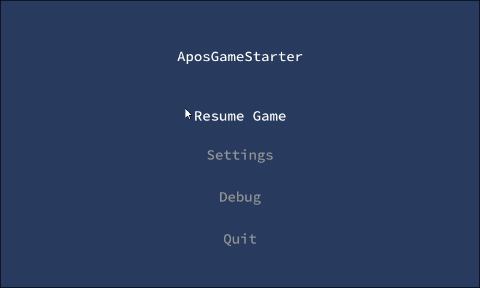

# Apos.Gui
UI library for MonoGame.

## Description

This library is designed to allow the creation of custom user facing UIs. It doesn't provide much out of the box except some mechanics to manage user inputs, focus handling, component parenting and hierarchy. It is inspired by the IMGUI paradigm.

[](https://discord.gg/N9t26Uv)

## Documentation

* [Getting started](https://apostolique.github.io/Apos.Gui/getting-started/)

## Build

[](https://www.nuget.org/packages/Apos.Gui/) [](https://www.nuget.org/packages/Apos.Gui/)

## Features

* Mouse, Keyboard, Gamepad (touch input is possible but not provided out of the box)
* UI scaling
* Used like IMGUI but components can be coded like a retained UI

## Showcase



## Usage Example

You can create a simple UI with the following code that you'll put in the Update call:

```csharp
MenuPanel.Push();
if (Button.Put("Show fun").Clicked) {
    _showFun = !_showFun;
}
if (_showFun) {
    Label.Put("This is fun!");
}
if (Button.Put("Quit").Clicked) {
    Exit();
}
MenuPanel.Pop();
```

This code will create 2 buttons, "Show Fun" and "Quit". You can use your mouse, keyboard, or gamepad to interact with them. Clicking on "Show Fun" will insert a label in between them with the text "This is fun!".

You can read more in the [Getting started](https://apostolique.github.io/Apos.Gui/getting-started/) guide.

## Other projects you might like

* [Apos.Input](https://github.com/Apostolique/Apos.Input) - Input library for MonoGame.
* [Apos.Camera](https://github.com/Apostolique/Apos.Camera) -  Camera library for MonoGame.
* [Apos.History](https://github.com/Apostolique/Apos.History) - A C# library that makes it easy to handle undo and redo.
* [Apos.Content](https://github.com/Apostolique/Apos.Content) - Content builder library for MonoGame.
* [Apos.Framework](https://github.com/Apostolique/Apos.Framework) - Game architecture for MonoGame.
